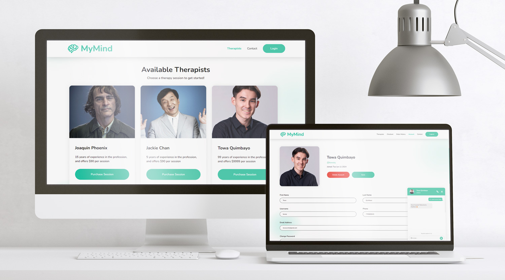
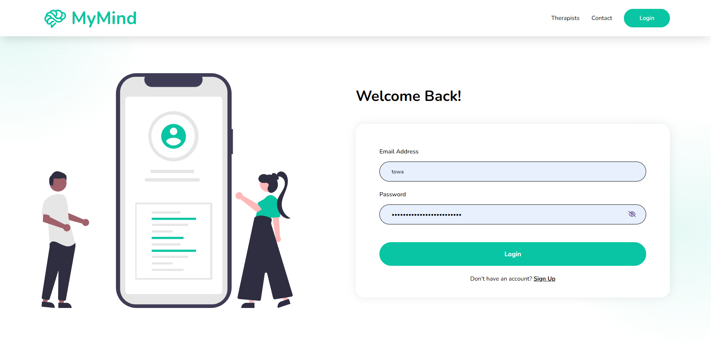
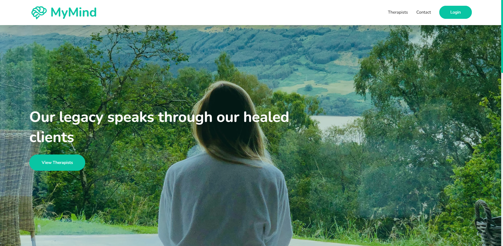
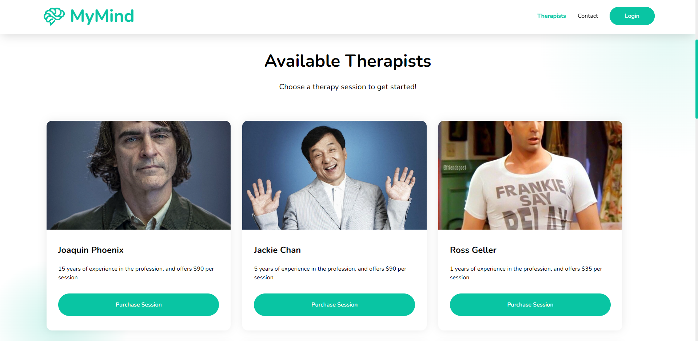
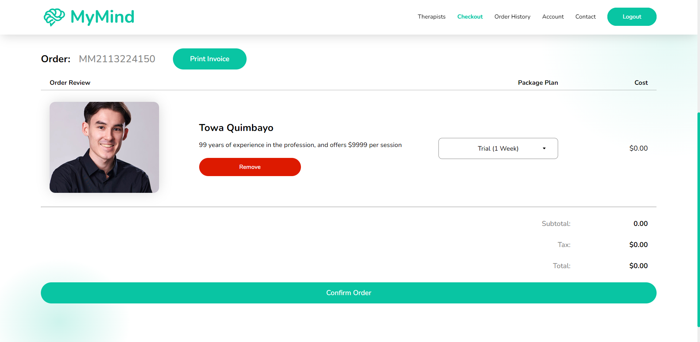
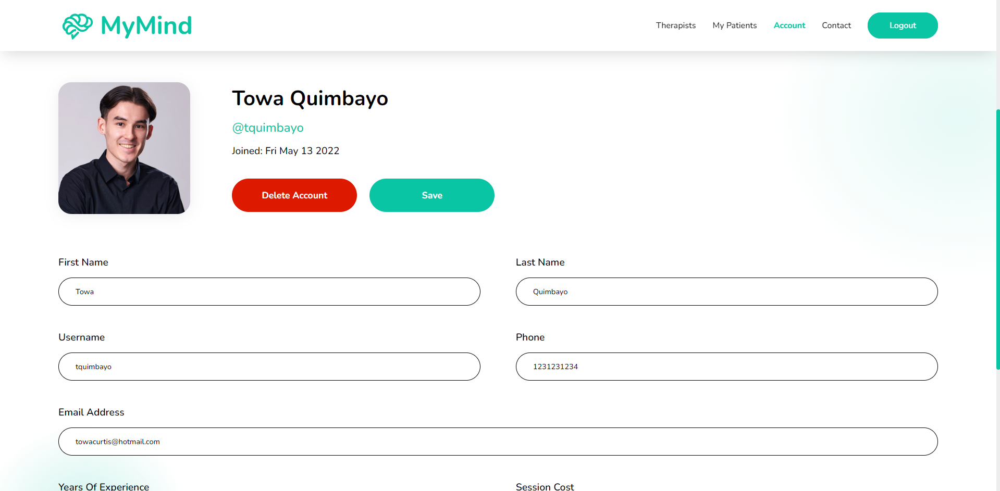
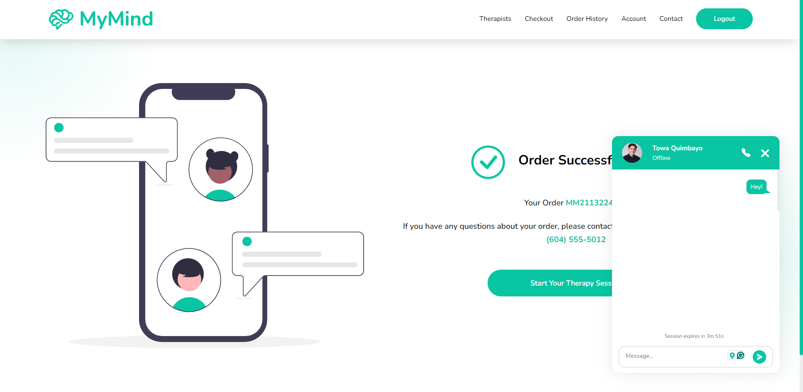

# MyMind


A mental health-focused web application, where patients can purchase therapy sessions offered by therapists. Scalability to update their session details and perform a live chat session with their patients when they purchase a session in an e-commerce-based transaction process.

_Check out the live project [_here_](https://mymind.towaquimbayo.com/)._

## Table of Contents

* [Screenshots](#screenshots)
* [Acknowledgements](#acknowledgements)
* [Technologies](#technologies)
* [Usage](#usage)
  * [Prerequisites](#prerequisites)
  * [Installation](#installation)
  * [Environment Variables Setup](#environment-variables-setup)
  * [Run The App](#run-the-app)
* [Features](#features)
  * [User Account Management](#user-account-management)
  * [Admin Dashboard](#admin-dashboard)
  * [Therapist Shopping Cart System](#therapist-shopping-cart-system)
  * [Live Chat Session](#live-chat-session)
  * [Easter Egg](#easter-egg)
* [Awards](#awards)
* [Contributing](#contributing)

## Screenshots

|  |  |
|:--:|:--:|
| _Login Page_ | _Home Page_ |
|  |  |
| _Therapists Page_ | _Checkout Page_ |
|  |  |
| _Profile Page_ | _Live Chat Popup_ |

## Acknowledgements

* Towa Quimbayo [GitHub](https://github.com/towaquimbayo) [LinkedIn](https://www.linkedin.com/in/towa-quimbayo/)
* Pedro Sales-Muniz [GitHub](https://github.com/salesp07) [LinkedIn](https://www.linkedin.com/in/pedro-sales-muniz/)
* Kian Azizkhani [GitHub](https://github.com/KianAzizkhani) [LinkedIn](https://www.linkedin.com/in/kian-azizkhani/)
* Alex Gibbison [GitHub](https://github.com/Soultey) [LinkedIn](https://www.linkedin.com/in/alexander-gibbison-786683153/)

[](https://github.com/towaquimbayo/MyMind/graphs/contributors)

## Technologies

* HTML5
* CSS3
* Ajax
* JavaScript
* jQuery `v3.6.0`
* Node.js
* Express `v4.18.1`
* Express-Session `v1.17.2`
* MongoDB / Mongoose `v6.3.3`
* Multer `v1.4.4`
* Nodemailer `v6.7.5`
* Nodemon `v2.0.16`
* Socket.IO `v4.5.1`

## Usage

<details>
  <summary>Prerequisites</summary>

### Prerequisites

* [VSCode](https://code.visualstudio.com/download/)
* [Git](https://git-scm.com/downloads/)
* [Node.js](https://nodejs.org/en/download/)

</details>

<details>
  <summary>Installation</summary>

### Installation

1. Install latest npm package version.

  ```sh
  npm install npm@latest -g
  ```

2. Clone the repository to local machine.

  ```sh
  git clone https://github.com/towaquimbayo/MyMind.git
  ```

3. Installing required dependencies requires Node and npm.

  ```sh
  npm install
  ```

</details>

<details>
  <summary>Environment Variables Setup</summary>

### Environment Variables Setup

For the project to run correctly, environment variables are required. Rename the `.env.example` to `.env`.

1. Create a free MongoDB Atlas account at <https://www.mongodb.com/cloud/atlas/register>. Then create a database Cluster and connect your project to that Cluster by clicking on the `Connect`, select the `Connect To Your Application` option and copy the Database `URI` string as your `DATABASE_URL`. Finally, replace the `username` and `password` fields in the URI string with your database credentials.
2. Either enter your email account credentials for the Nodemailer transporter credentials or create a Gmail account to generate an App Password by following the instructions at <https://medium.com/@y.mehnati_49486/how-to-send-an-email-from-your-gmail-account-with-nodemailer-837bf09a7628>.

</details>

<details>
  <summary>Run The App</summary>

### Run The App

Running the application locally or in production is straightforward since both the frontend and backend are integrated into a single Node.js application running on port 8000.

Execute `npm start` to run locally in development mode or production mode.

</details>

## Features

### User Account Management

Our user account management system allows users to create and manage their accounts securely with ease. Whether they are therapists or patients, users have control over their profile information.

* __Account Creation__: Users can create therapist or patient accounts. Therapists are required to enter additional information regarding their session cost and professional experience.
* __Account Editing__: Users can edit their profile information, including profile picture, name, email, and phone number.
* __Account Deletion__: Users have the option to delete their accounts.

### Admin Dashboard

Our Admin Dashboard provides administrators with comprehensive tools to manage all users registered on the application. This feature ensures that administrators can maintain control over the platform's user base and perform various administrative tasks efficiently.

* __User Management__: View all users in a table format on the Admin Dashboard page. Admininstrators can also edit patient and therapist information, create new users including adminstrators, and delete user accounts if necessary.
* __Search and Filter__: Search users by keywords and filter the table accordingly.
* __Sorting Table__: Sort the user table by clicking on headings such as email or username in ascending or descending order.

### Therapist Shopping Cart System

Our application features a therapist shopping cart system, allowing users to browse and "purchase" live chat sessions with therapists. Although a payment integration system is not yet implemented, patients can simulate the process of adding therapists to their cart and checking out.

* __Therapist Listings__: Any user can view a list of available therapists for live chat sessions.
* __Shopping Cart__: Registered patients can add or remove therapists to their shopping cart and proceed to the Checkout page. The Checkout cart page also displays the total price including tax for the cart items.
* __Invoice Generation__: Patients can print an invoice PDF of their order from the Checkout page.
* __Order Confirmation__: After confirming their cart and checking out, patients are navigated to a Thank You page and receive an email confirmation. They can start a live chat session with the ordered therapist immediately.
* __Pricing Plans__: 4 different pricing plans are available for therapist sessions: Trial, 1 Month, 3 Months, and 1 Year (mocked up to reasonable timeframes in minutes).

### Live Chat Session

We enable real-time communication between therapists and patients using Socket.io. This feature allows for seamless live chat sessions, enhancing the user experience.

* __Real-Time Communication__: Bi-directional private communication for live therapist chat sessions.
* __Contact Information__: Both patient and therapist can access each other’s phone numbers during the live chat session for private communication via text or phone call.
* __Session Timer__: Display of remaining session time in real-time, with the chat ending automatically when time expires.

### Easter Egg

For those who love surprises, we have included a hidden Easter Egg feature. On the signup page, enter "batman" in the username field and turn up the volume for the best experience. Get ready to be ... _**mindblown 🦇**_

## Awards

Our project, MyMind, was honored with the "Best Design" and "Best Teamwork" awards out of 219 students for its innovative approach to virtual therapy. MyMind offers virtual therapy sessions, ensuring both patients and therapists can comfortably engage from their homes, and students can attend to their mental health within their busy schedules. This recognition reflects our dedication to user-centered design and effective teamwork throughout the development process.

For more details, you can read the [full article here](https://commons.bcit.ca/news/2022/06/computing-students-develop-apps-to-make-life-better/).

# Contributing

Contributions are what make the open source community such an amazing place to be learn, inspire, and create. Any contributions you make are __extremely appreciated__.

For more details, please refer to [CONTRIBUTING.md](CONTRIBUTING.md)
